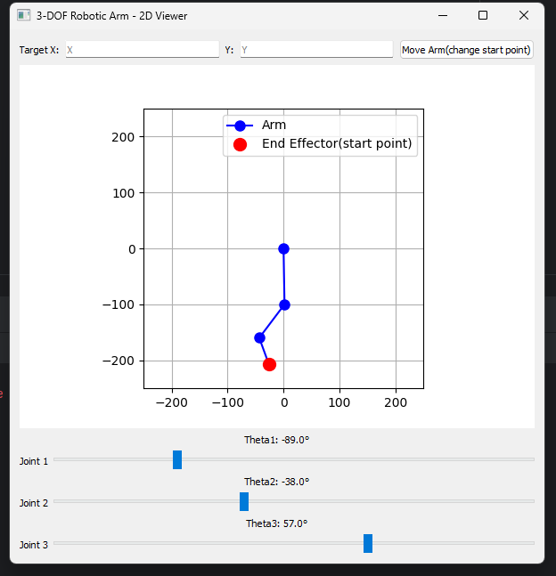

# A simple demo of using RestAPI to control pose of robotic arm end-effector




This project implements a 3-DOF robotic arm simulation and control system. It provides both a REST API and a graphical user interface (GUI) for controlling and visualizing the robotic arm.

## Key Features

- **Inverse Kinematics**: Calculates joint angles (`theta1`, `theta2`, `theta3`) to reach a target position (`x`, `y`).
- **REST API**: Allows external applications to control the robotic arm end-effector start pose.
- **GUI**: Provides interface for manual control and a 2D visualization of the robotic arm movement when user uses RestAPI web broswer interface.


## Files

- `sorted_numbers_threads.cpp` – Main source file containing threading logic.
- `CMakeLists.txt` – Build configuration file.
- `README.md` – This documentation.

## Install the required dependencies:

```bash
 pip install -r .\requirements.txt

```


## Example

1- Start the application

```bash
 python robotic_arm_ui.py

```

2- Open web browser after running the program at [http://127.0.0.1:5000/swagger/](http://127.0.0.1:5000/swagger/) and start to excute commands via web UI and see the result in robotic arm GUI. 
